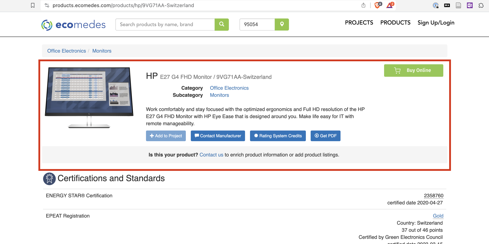
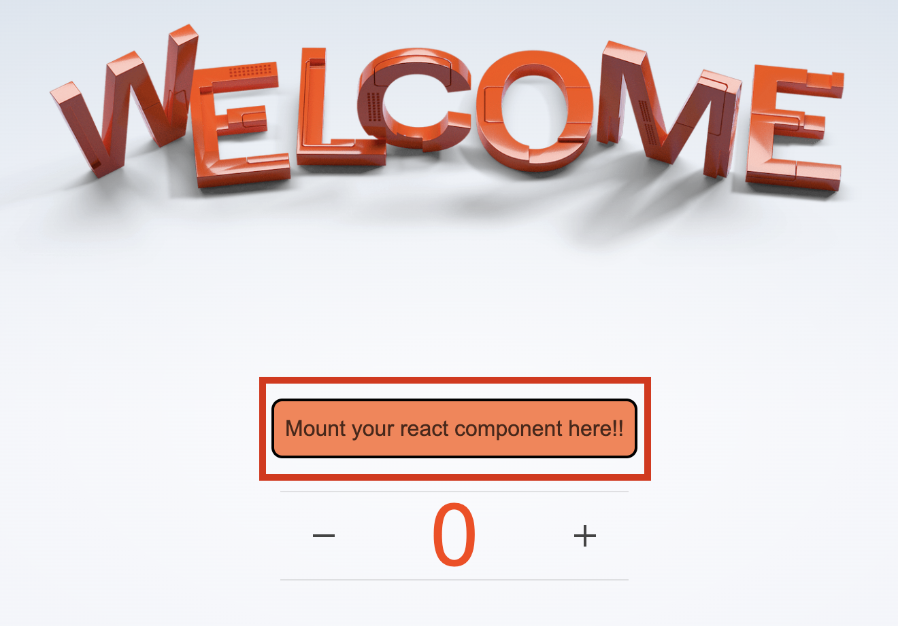
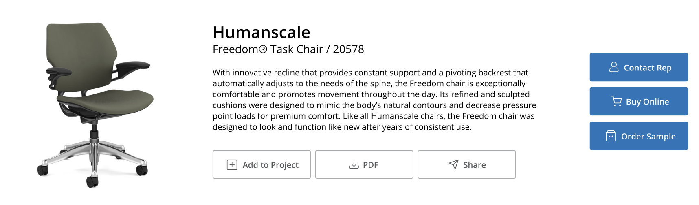
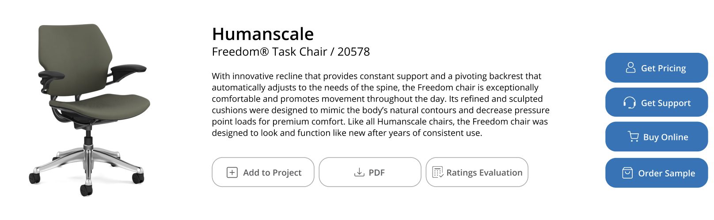

# ecomedes Front End Code Test

## Overview

This is a code test for Ecomedes. We have tried to design a test that is similar to the actual work the job requires.

At Ecomedes, our webapp is implemented in a legacy technology, [om.next](https://github.com/omcljs/om/wiki#om-next) that we are trying to migrate away from. Our plan is to migrate the app one component at a time. We build the components in a separate project, and then mount them into elements of our pages.

For example, in our production code, we are going to replace a portion of our product detail page with a component:



To simulate this situation we created a simple project using [svelte](https://github.com/sveltejs/svelte). This repository contains a small webapp that we want to mount a react component in to.



At a high level, the `component` must:

- be delivered as javascript library
- be mountable into a given HTMLElement
- expose a callback function the parent page will use to convey state changes to the component (see below for details)

We are trying to assess your ability to write clean, well-organized code that is easy to understand and maintain. We are also trying to assess your ability to learn new technologies and apply them to solve problems.

## Requirements

### Visual Design

We want you to create a React component that will display details about a product. The component should display the following information:

- Product Name
- Product Brand
- Product Description
- Product Image

It should also have the following buttons:

| Button Text     | Required or Optional |
| --------------- | -------------------- |
| Add to Project  | Required             |
| Download PDF    | Required             |
| Share           | Required             |
| Contact Rep     | Required             |
| Contact Support | Optional             |
| Buy Online      | Required             |
| Order Sample    | Required             |

Note that the sample [product data](src/data/products.ts) has a `boolean` `showSupport` property. Only show `Contact Support` button if its value is `true`.

Here are some mockups of how the component should look:



or



### Functionality

The component will be given an array of products and an initial index in its props. It should render the product at the given index. Also, it should be able to respond to changes in state (conveyed via a callback). When the state changes the component should display the product at the given index in the array. If the number is out of bounds, it should display the first or last product in the array.

The state is the number on the page you're mounting your component into (see the image above). When the user clicks the "+" or "-" buttons, the parent page will call your component's callback with the new state as a parameter. Your component should then display the appropriate product.

For simplicyt, none of the buttons need to do anything. They just need to be displayed.

## How to Get Up and Running

1. Clone this repository
2. Ensure you can run the app locally by running `npm install` and `npm run dev`. You should see a page like the one above at http://localhost:5173
3. Create a new javascript repository on GitHub
4. In that repository, implement a javascript library that loads an object into the `window` object. For example:

```javascript
window.externalComponent = {
  // your code here
};
```

The object should have the following type (these types are defined in [external-component.ts](./src/lib/external-component.ts)):

```typescript
type DemoComponent = {
  // This function will be called by the svelte app to mount your component into the page.
  mount(element: HTMLElement, props: DemoComponentProps): HandleStateChange;
  // This function will be called by the svelte app to unmount your component from the page.
  unmount(): void;
};

// The type of the props that will be handed to your component.
type DemoComponentProps = {
  products: Product[];
  index: number;
};
// This function will be called by the svelte app when the component needs to respond to a change in state.
type HandleStateChange = (state: number) => void;
```

Details about the `Product` type can be found in the [products.ts](./src/data/products.ts) file.

5. Compile the library (using whatever tooling you prefer) into a single javascript file and place it in the `/static/external-component.js` file in this repository.

# svelte

The host project is built using [svelte](https://svelte.dev). We are not testing for any knowledge of svelte. We are using svelete here simply to simulate mounting a React component into a web app built on a different technology.

We do not anticipate that you will need details on svelte, but if you do, what follows is the default svelte readme. And you can find more information about [svelte here](https://github.com/sveltejs/svelte). If you need to see the details of how the svelte app will be mounting your component, you can look at the [external-component.ts](./src/lib/external-component.ts) file.

## create-svelte

Everything you need to build a Svelte project, powered by [`create-svelte`](https://github.com/sveltejs/kit/tree/master/packages/create-svelte).

### Creating a project

If you're seeing this, you've probably already done this step. Congrats!

```bash
# create a new project in the current directory
npm create svelte@latest

# create a new project in my-app
npm create svelte@latest my-app
```

### Developing

Once you've created a project and installed dependencies with `npm install` (or `pnpm install` or `yarn`), start a development server:

```bash
npm run dev

# or start the server and open the app in a new browser tab
npm run dev -- --open
```

### Building

To create a production version of your app:

```bash
npm run build
```

You can preview the production build with `npm run preview`.

> To deploy your app, you may need to install an [adapter](https://kit.svelte.dev/docs/adapters) for your target environment.
